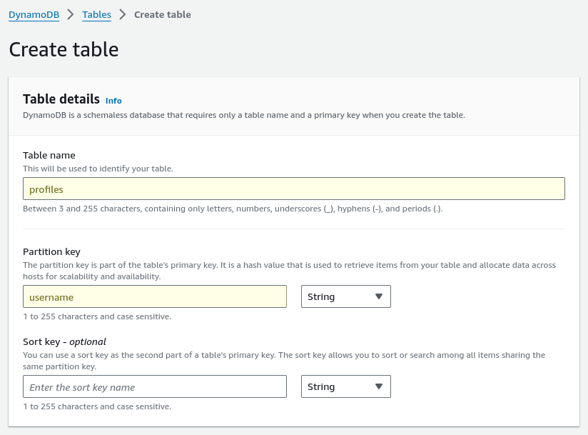

# User Profiles (a.k.a. Profiler)

Profiles are used to store user data like tabs and SQL statements.  They are only accessible by the user for which they were created.  It is not possible to share profiles yet.

## Local Profiles

The most basic method of profile storage is to save them in a folder on the local server.  To enable local profile storage enter the following in the *settings.yml* file:

``` yaml
profiler:
  type: local
  path: /tmp/profiles
```

!!! warning "Cloud Installations"
    Cloud-based installations must use a cloud-compatible user profiles option.  Local profiles are not supported in cloud-based installations.

## DynamoDB Profiles

### &raquo; Basic Configuration

The minimum configuration for AWS DynamoDB requires a table name and a region.

``` yaml
profiler:
  type: dynamodb
  table: profiles
```

The table creation is quite straightforward and only requires that the primary parition key be a *String* and be named **username** as shown below:



Permissions are required for **GetItem**, **PutItem**, **UpdateItem**, **DeleteItem**, and **Scan** on the created table.  If you enable encryption (which is strongly *recommended*) then you need to insure that you also grant access to the KMS key selected for that feature to allow **Encrypt** and **Decrypt** operations.

!!! important
    Both the profiler and the session tokens use a similar structure but they must be separate tables to avoid conflicting if using DynamoDB for both.  It is recommended to use S3 for User Profiles and DynamoDB for Session Tokens for optimal cost and storage.

### &raquo; Using AWS Profiles

If you use the AWS-CLI to configure a profile you can reference that profile using the ```profile_name``` option as demonstrated below:

``` yaml
profiler:
  type: dynamodb
  table: profiles
  profile_name: your_aws_cli_profile_name_here
  aws_region_name: us-east-1
```

### &raquo; Using Access Keys and Secret Keys (not recommended)

If you absolutely must use access keys and secret keys then you can do so using the example below:

``` yaml
profiler:
  type: dynamodb
  table: profiler
  aws_access_key: your_aws_access_key_here
  aws_secret_key: your_aws_secret_key_here
  aws_region_name: us-east-1
```

## AWS S3 Profiles

### &raquo; Basic Configuration

The minimum configuration for AWS S3 requires a bucket name.  Optionally you can specify a prefix for the object name.

``` yaml
profiler:
  type: s3
  bucket: my-s3-bucket-name
  prefix: querycommander/profiles
```

Permissions are required for **GetObject**, **PutObject**, **DeleteObject** on the created bucket.  If you enable encryption (which is strongly *recommended*) then you need to insure that you also grant access to the KMS key selected for that feature to allow **Encrypt** and **Decrypt** operations.

### &raquo; Using AWS Profiles

If you use the AWS-CLI to configure a profile you can reference that profile using the ```profile_name``` option as demonstrated below:

``` yaml
profiler:
  type: s3
  bucket: my-s3-bucket-name
  prefix: querycommander/profiles
  profile_name: your_aws_cli_profile_name_here
  aws_region_name: us-east-1
```

### &raquo; Using Access Keys and Secret Keys (not recommended)

If you absolutely must use access keys and secret keys then you can do so using the example below:

``` yaml
profiler:
  type: s3
  bucket: my-s3-bucket-name
  prefix: querycommander/profiles
  aws_access_key: your_aws_access_key_here
  aws_secret_key: your_aws_secret_key_here
  aws_region_name: us-east-1
```
