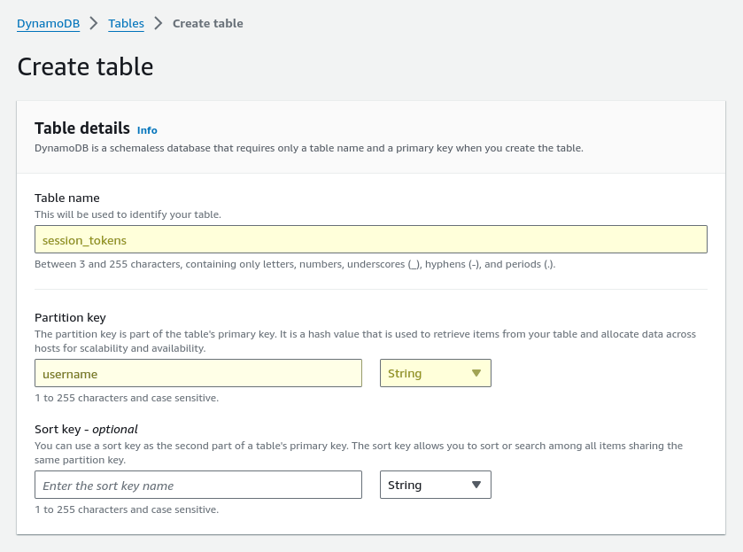

# Session Management (a.k.a. Tokenizer)

Tokens are used to store temporary session-specific information for logged in users.

!!! danger "Set a Strong Safe Password"
    The ```safe_password``` is used to encrypt credentials when storing them on the session token for the **local** [authenticator](./authenticator.md) so be sure to use a strong password. *(Other authenticators like openldap or microsoft do not use this setting.)*

## Local Tokens

The most basic method of token storage is to save them in a folder on the local server.  To enable local token storage enter the following in the *settings.yml* file:

``` yaml
tokenizer:
  type: local
  timeout: 20 # minutes
  safe_password: abc123456abcdef
  path: /tmp/tokens
```

!!! warning "Cloud Installations"
    Cloud-based installations must use a cloud-compatible session management option.  Local tokens are not supported in cloud-based installations.

## DynamoDB Tokens

### &raquo; Basic Configuration

The minimum configuration for AWS DynamoDB requires a table name and a region.

``` yaml
tokenizer:
  type: dynamodb
  timeout: 20 # minutes
  safe_password: abc123456abcdef
  table: session_tokens
```

The table creation is quite straightforward and only requires that the primary parition key be a *String* and be named **username** as shown below:



Permissions are required for **GetItem**, **PutItem**, **UpdateItem**, **DeleteItem**, and **Scan** on the created table.  If you enable encryption (which is strongly *recommended*) then you need to insure that you also grant access to the KMS key selected for that feature to allow **Encrypt** and **Decrypt** operations.

!!! important
    Both the profiler and the session tokens use a similar structure but they must be separate tables to avoid conflicting if using DynamoDB for both.  It is recommended to use S3 for User Profiles and DynamoDB for Session Tokens for optimal cost and storage.

### &raquo; Using AWS Profiles

If you use the AWS-CLI to configure a profile you can reference that profile using the ```profile_name``` option as demonstrated below:

``` yaml
tokenizer:
  type: dynamodb
  timeout: 20 # minutes
  safe_password: abc123456abcdef
  table: session_tokens
  profile_name: your_aws_cli_profile_name_here
  aws_region_name: us-east-1
```

### &raquo; Using Access Keys and Secret Keys (not recommended)

If you absolutely must use access keys and secret keys then you can do so using the example below:

``` yaml
tokenizer:
  type: dynamodb
  timeout: 20 # minutes
  safe_password: abc123456abcdef
  table: session_tokens
  aws_access_key: your_aws_access_key_here
  aws_secret_key: your_aws_secret_key_here
  aws_region_name: us-east-1
```

## Redis Tokens

The minimum configuration for Redis requires a server name and will use the default port 6379.  You can also enable SSL connections as shown below:

``` yaml
tokenizer:
  type: redis
  timeout: 20 # minutes
  safe_password: abc123456abcdef
  host: localhost
  port: 6379
  options:
    ssl: true
```