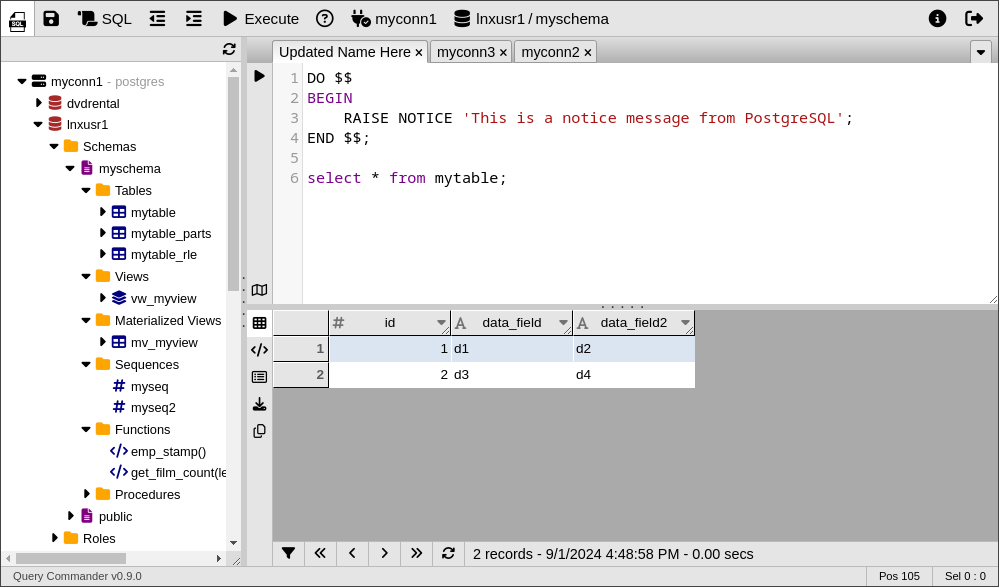

# Query Commander &middot; [](https://github.com/lnxusr1/query-commander/blob/master/LICENSE)   

!!! important "Works with AWS Lambda!"
    You can install **Query Commander** in your AWS environment and run it completely *serverless*.  Upgrades/Downgrades are simple using AWS Lambda layers.  Check out more on the [AWS Lambda installation](./installation/aws.md) page.

Introducing **Query Commander**, the *opensource* browser-based SQL tool designed for secure and efficient database management. 



## Features:

1. **Database Connectivity**

    - Support for multiple server connections and heterogeneous targets
    - Support for multiple database types: <br>
      *(Oracle, PostgreSQL, Redshift, MySQL, Trino/PrestoSQL, etc.)*

3. **Database Management**
    - Viewing of database objects
    - Browse Schemas
    - Data export capabilities
    - Explain Plain visualization

4. **Metadata Access**
    - View table structures, constraints, indexes, relationships, roles, and permissions
    - Generate ddl for views, materialized views, procedures, functions, and much more

5. **User Interface**
    - Intuitive, familiar, and user-friendly interface
    - Browser-based multi-tab and multi-window interface
    - SQL Editor: Custom SQL Execution and results display
    - Syntax highlighting

6. **Enhanced Security**
    - Support for End-to-End Encryption
    - Multiple authentication options (Database login-based, LDAP/Active Directory)
    - Optional time-based rate limits for queries executed and/or total records retrieved by user
    - Advanced permissions management with "Persona proxies" and group-based authorization
    - Ideal for cloud-hosted and remote database server access
    - Support for AWS Secret Manager for secure credential storage and database server info

7. **Modern Hosting Options**
    - Traditional installation with CGI executions
    - Optional **Serverless** installation

!!! note "Serverless Hosting"
    Serverless hosting in AWS leverages the combination of **S3** file storage for static objects, **API Gateway** + **Lambda** for backend processing, **DynamoDB** for secure token storage, and **Secrets Manager** for encrypted password management.

!!! danger "SECURITY: SOX and HIPAA Compliance"
    By enabling LDAP authentication Query Commander can leverage "Persona proxies" which allow for linking role-based access in the database to users authenticated via LDAP.  
    
    Persona proxies (a.k.a. role-based service accounts) eliminate the need for users to be individually created/maintained inside the database.  This feature can save time being wasted on database account management and access pruning which can be significant depending on the size of your userbase.

## Installation

**&raquo; Check out** the [**Apache 2.x**](./installation/apache.md) and [**AWS Lambda**](./installation/aws.md) installation options.

#### General Installation
For local installations the easiest way to get started is to use pip as shown below:

``` bash
pip install querycommander
```

The above installs the basic software and only includes AWS integrations by default.  To install specific connectors or components use one or more of the following commands:

``` bash
# Database Connectors
pip install querycommander[postgres]
pip install querycommander[mysql]
pip install querycommander[oracle]
pip install querycommander[redshift]

# Other connectors
pip install querycommander[redis] # For Redis session token storage
pip install querycommander[ldap]  # For LDAP authentication

# Install everything in one command
pip install querycommander[all]
```


