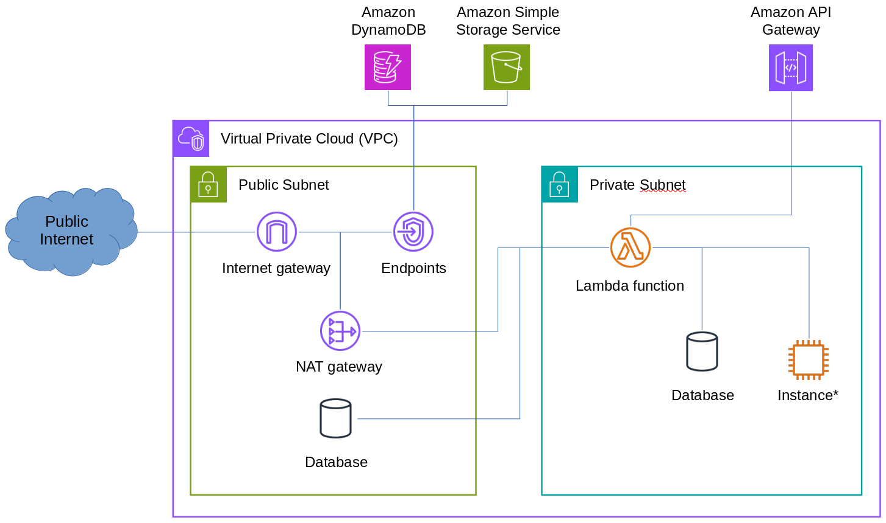

# AWS Cloud Installation

To use Query Commander with API Gateway + Lambda you must attach the Lambda to a VPC subnet.  Doing so may require additional configuration depending on your environment.

## Intial Setup

For optimal performance two APIs are required.  The REST API serves the pages and simple data objects while the Websocket enables longer running queries to be possible due to AWS timeout limitations in the API Gateway service.  *Without both APIs in place the maximum runtime for a query is 29 seconds.*

!!! important
    For the package creation to work properly you should execute all commands on an Amazon Linux x86_64 server as this is most similar to the Lambda runtime environment of the same architecture.

### Step 1: Create the Lambda Layer

It is recommending to use pip to set up the libraries on which query commander depends.  This is fairly easy to achieve using the following:

``` bash
# Create a directory for the installation
mkdir ./package  

# Install all the dependencies along with the core query commander
pip install \
    --platform manylinux2014_x86_64 \
    --target=./package \
    --implementation cp \
    --python-version 3.12 \
    --only-binary=:all: \
    --upgrade \
    querycommander[lambda]

cd ./package
zip -r ../package.zip *
```

Now go into AWS and upload the zip file just created as a new layer.  If you already have a layer you can upload the zip file as a new version on the existing layer.  Make sure to select the proper runtime (Python 3.11 and/or Python 3.12 are the recommended runtimes with x86_64 architecture)

!!! note
    Releases since 0.6.2 have included a pre-built Python layer for AWS Lambda.  The pre-built layer requires Python 3.12 runtime.  You can download the zip by visiting the [release page](https://github.com/lnxusr1/query-commander/releases/latest).

### Step 2: Create the Lambda Function

1. Create a new function as "Author from Scratch".
2. Enter a function name of your choice
3. Select a runtime (Python 3.12 is recommended)
4. Select an architecture (x86_64 is recommended)
5. Under "Permissions / change default execution rule" select (or create) an execution role:
    - CloudWatch Required Permissions:
        - logs:CreateLogGroup
        - logs:CreateLogStream
        - logs:PutLogEvents
    - EC2 Network Permissions (required to connect Lambda to a VPC)
        - ec2:CreateNetworkInterface
        - ec2:DescribeNetworkInterfaces
        - ec2:DescribeSubnets
        - ec2:DeleteNetworkInterface
        - ec2:AssignPrivateIpAddresses
        - ec2:UnassignPrivateIpAddresses
    - Add other permissions you plan to use like DynamoDB or S3
6. Under "Advanced" check the box for "Enable VPC"
    - Select the desired VPC
    - Select the subnets to send traffic through (you need at least 2)
    - Select the security group(s)
7. Click **Create Function**

### Step 3: Create Env Variables in Function

1. Open the newly created function and choose *Configuration*
2. Select *Environment variables*
3. Click *Edit* on the Environment Variables list
4. Click *Add environment variable*
5. Enter the values:
    - Key: QRYCOMM_CONFIG_PATH
    - Value: /var/task
6. Click **Save**

### Step 4: Add Layer to Function

1. Open the function and choose *Code*
2. Scroll to the bottom and find the Layers section and click **Add Layer**
3. Select the *Custom Layer* option and then pick the layer created in Step 1
4. Click **Add** to add the layer to the function

### Step 5: Add a settings.yml file to Function

1. Open the function and choose *Code*
2. In the editor add a new file called *settings.yml* alongside the existing lambda_function.py file
3. In the *settings.yml* file specify the [configuration](../configuration/basic.md) as desired.

!!! note
    You can update the settings.yml at any time, but each time you change it you'll need to **Deploy** your function for the changes to take effect.

### Step 6: Create the Python Handler code

In the lambda_function.py file delete all the code and add the following:

``` python
import sys

sys.path.insert(0, '/opt')
from querycommander import start


def lambda_handler(event, context):
 
    #logging.error(str(event))

    return start.as_lambda(event, context)
```

Once complete, save and click **Deploy** to publish the latest version of your function.

### Step 7: Set up API Gateway REST API

1. Navigate to the Lambda function in the AWS Console
2. Click "Add Trigger" in the chart at the top (above the Code window)
3. Select **API Gateway** in the drop down list
4. Choose to *Create a New API*
5. Select *REST API*
6. Choose *Open* from the security box
7. Click "Additional Details" to show more options
8. In "Binary Media Types" choose **Add**
9. Enter **\*/\*** in the box to indicate all types
10. Choose **Add** at the bottom to create the API

### Step 8: Set up API Gateway Websocket API

1. Navigate to the API Gateway service in the AWS Console
2. Click *Create API* and select **Build** under a Websocket API
3. Enter a *API Name* of your choice
4. For **Route selection expression** enter *request.body.command*
5. Click **Next**
6. Click *Add $default route*
7. Attach the **Lambda** integration and select the function from **Step #2**.
8. Click **Next**
9. Enter *production* in the stage name and click **Next**
10. Click **Create and deploy**

### Step 9: Adjust Lambda Runtime Configuration

Query Commander recommends adjusting the following:

- Set the timeout of the Lambda function to something reasonable for your use case.
- Allocate at least 512MB of Memory to the function for consistent operation.

!!! note
    While adjusting the timeout of the Lambda function it is strongly recommended to start low and increment in stages as setting long timeouts up front may create hurdles for troubleshooting.

## Making Lambda work in your VPC

Lambda can run inside a VPC, but when doing so it doesn't actually execute within the VPC itself.  It executes via a gateway that AWS sets up when you select Lambda to connect to the VPC.  This creates a problem because Lambda cannot send traffic over the VPC endpoint into your network and it traverse back out to the internet through a standard *Internet Gateway*.  So, to make that work you have to use a NAT gateway.  Here's the basic configuration.

1. Make sure your VPC has *at least two* fully private subnets that do not include an *Internet Gateway* in their routing table
2. Attach Lambda to the two fully private subnets
3. Place your NAT gateway in a public subnet (a subnet with a route table that has an *Internet Gateway* in it)
4. Set the default route of your private subnet to route traffic over to the NAT gateway in the public subnet.

Doing this allows Lambda to connect to devices inside your network while still being able to connect to AWS services like DynamoDB and S3.



!!! note
    Any VPC Service Endpoints you create for AWS services should be in your public subnet and the NAT gateway will honor those and not send your internal AWS traffic over the public Internet.